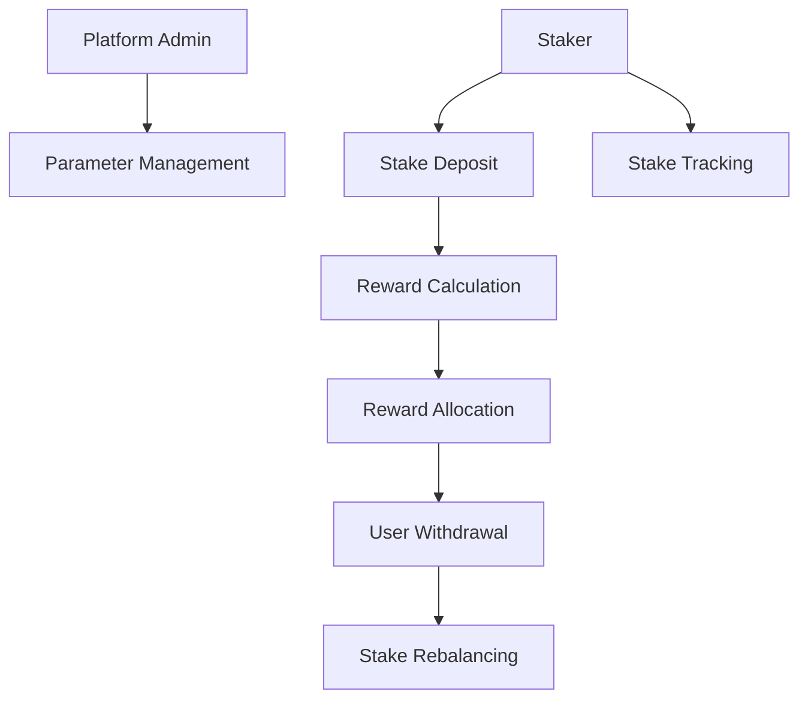

# Concurrent Stake: Decentralized Staking Platform

A sophisticated on-chain staking mechanism that enables concurrent reward allocation and dynamic stake management on the Stacks blockchain.

## Overview

Concurrent Stake is an innovative decentralized finance (DeFi) platform that provides flexible, secure, and transparent staking infrastructure. The platform allows users to stake tokens, earn rewards, and participate in a dynamically managed reward allocation system.

### Key Features
- Concurrent reward calculation
- Dynamic stake allocation
- Transparent reward distribution
- Flexible stake management
- Low-overhead smart contract design
- Configurable reward parameters

## Architecture

The platform is built around a single core smart contract that manages staking, reward calculations, and allocation mechanisms.



## Contract Documentation

### Core Contract: stake-allocator.clar

#### Purpose
Manages the entire lifecycle of staking operations, including stake deposit, reward calculation, and token distribution.

#### Key Components
1. **Stake Tracking**: Manages individual and total stake amounts
2. **Reward Calculation**: Dynamically computes rewards based on stake
3. **Allocation Mechanisms**: Distributes rewards fairly
4. **Administrative Controls**: Platform parameter management

## Getting Started

### Prerequisites
- Clarinet installed
- Stacks wallet for deployment/interaction

### Usage Examples

1. Deposit Stake:
```clarity
(contract-call? .stake-allocator deposit-stake u1000000 u30)
```

2. Calculate Rewards:
```clarity
(contract-call? .stake-allocator calculate-rewards tx-sender)
```

3. Withdraw Stake:
```clarity
(contract-call? .stake-allocator withdraw-stake u500000)
```

## Function Reference

### Stake Management
- `deposit-stake`: Add tokens to stake pool
- `withdraw-stake`: Remove tokens from stake pool
- `get-stake-balance`: Check current stake amount

### Reward Operations
- `calculate-rewards`: Compute pending rewards
- `claim-rewards`: Transfer earned rewards
- `get-reward-rate`: Check current reward rate

### Administrative
- `set-reward-parameters`: Update reward calculation logic
- `set-platform-fee`: Adjust platform fee

## Development

### Local Testing
```bash
# Run local tests
clarinet test

# Check contract
clarinet check
```

### Deployment
```bash
# Deploy to testnet
clarinet deploy --testnet

# Deploy to mainnet
clarinet deploy --mainnet
```

## Security Considerations

### Limitations
- Maximum stake amount
- Minimum stake duration
- Platform fee caps
- Reward calculation constraints

### Best Practices
1. Verify stake transactions
2. Monitor reward allocations
3. Understand stake lockup periods
4. Validate stake parameters
5. Use hardware wallet for large stakes

### Economic Security
- Transparent reward calculations
- Minimal external dependencies
- On-chain verification mechanisms